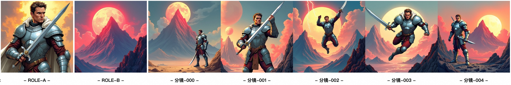
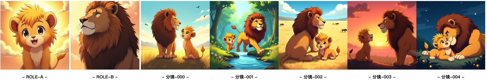

<div align="center">
<h1>AnyStory: Towards Unified Single and Multiple Subject Personalization in Text-to-Image Generation</h1>

<a href='https://aigcdesigngroup.github.io/AnyStory/'></a>
<a href='https://arxiv.org/pdf/2501.09503'></a>
<a href='https://huggingface.co/spaces/modelscope/AnyStory'></a>
<a href='https://modelscope.cn/studios/iic/AnyStory'></a>

</div>


AnyStory is a unified approach for personalized subject generation. It not only achieves high-fidelity personalization for single subjects, but also for multiple subjects, without sacrificing subject fidelity.

---

## News

- [2025/05/01] 🚀 We release the code and demo for the `FLUX.1-dev` version of AnyStory.

## Usage

```python
import torch
from PIL import Image

from huggingface_hub import hf_hub_download
from anystory.generate import AnyStoryFluxPipeline

anystory_path = hf_hub_download(repo_id="Junjie96/AnyStory", filename="anystory_flux.bin")
story_pipe = AnyStoryFluxPipeline(
    hf_flux_pipeline_path="black-forest-labs/FLUX.1-dev",
    hf_flux_redux_path="black-forest-labs/FLUX.1-Redux-dev",
    anystory_path=anystory_path,
    device="cuda",
    torch_dtype=torch.bfloat16
)
# you can add lora here
# story_pipe.flux_pipeline.load_lora_weights(lora_path, adapter_name="...")

# single-subject
subject_image = Image.open("assets/examples/1.webp").convert("RGB")
subject_mask = Image.open("assets/examples/1_mask.webp").convert("L")
prompt = "Cartoon style. A sheep is riding a skateboard and gliding through the city," \
         " holding a wooden sign that says \"hello\"."
image = story_pipe.generate(prompt=prompt, images=[subject_image], masks=[subject_mask], seed=2025,
                            num_inference_steps=25, height=512, width=512,
                            guidance_scale=3.5)
image.save("output_1.png")

# multi-subject
subject_image_1 = Image.open("assets/examples/6_1.webp").convert("RGB")
subject_mask_1 = Image.open("assets/examples/6_1_mask.webp").convert("L")
subject_image_2 = Image.open("assets/examples/6_2.webp").convert("RGB")
subject_mask_2 = Image.open("assets/examples/6_2_mask.webp").convert("L")
prompt = "Two men are sitting by a wooden table, which is laden with delicious food and a pot of wine. " \
         "One of the men holds a wine glass, drinking heartily with a bold expression; " \
         "the other smiles as he pours wine for his companion, both of them engaged in cheerful conversation. " \
         "In the background is an ancient pavilion surrounded by emerald bamboo groves, with sunlight filtering " \
         "through the leaves to cast dappled shadows."

image = story_pipe.generate(prompt=prompt,
                            images=[subject_image_1, subject_image_2],
                            masks=[subject_mask_1, subject_mask_2],
                            seed=2025,
                            enable_router=True, ref_start_at=0.09,
                            num_inference_steps=25, height=512, width=512,
                            guidance_scale=3.5)
image.save("output_2.png")
```

### Storyboard generation

```python
import json
from storyboard import StoryboardPipeline

storyboard_pipe = StoryboardPipeline()

storyboard_pipe.new_story()
script_dict = json.load(open("assets/scripts/013420.json"))
print(script_dict)
results = storyboard_pipe(script_dict, style_name="Comic book")
for key, result in results.items():
    result.save(f"output_1_{key}.png")

# 狮子王辛巴成长
storyboard_pipe.new_story()
script_dict = json.load(open("assets/scripts/014933.json"))
print(script_dict)
results = storyboard_pipe(script_dict, style_name="Japanese Anime")
for key, result in results.items():
    result.save(f"output_2_{key}.png")
```

Example output:




## Applications

Intelligent creation of AI story pictures with [Qwen](https://github.com/QwenLM/Qwen3) Agent (please refer to `storyboard.py`)


AI Animation Video Production with [Wan](https://github.com/Wan-Video/Wan2.1) Image-to-Video

(please refer to [`assets/example_videos`](assets/example_videos))

## **Acknowledgements**

This code is built on [diffusers](https://github.com/huggingface/diffusers)
and [OminiControl](https://github.com/Yuanshi9815/OminiControl). Highly appreciate their great work!

## Cite

```bibtex
@article{he2025anystory,
  title={AnyStory: Towards Unified Single and Multiple Subject Personalization in Text-to-Image Generation},
  author={He, Junjie and Tuo, Yuxiang and Chen, Binghui and Zhong, Chongyang and Geng, Yifeng and Bo, Liefeng},
  journal={arXiv preprint arXiv:2501.09503},
  year={2025}
}
```
